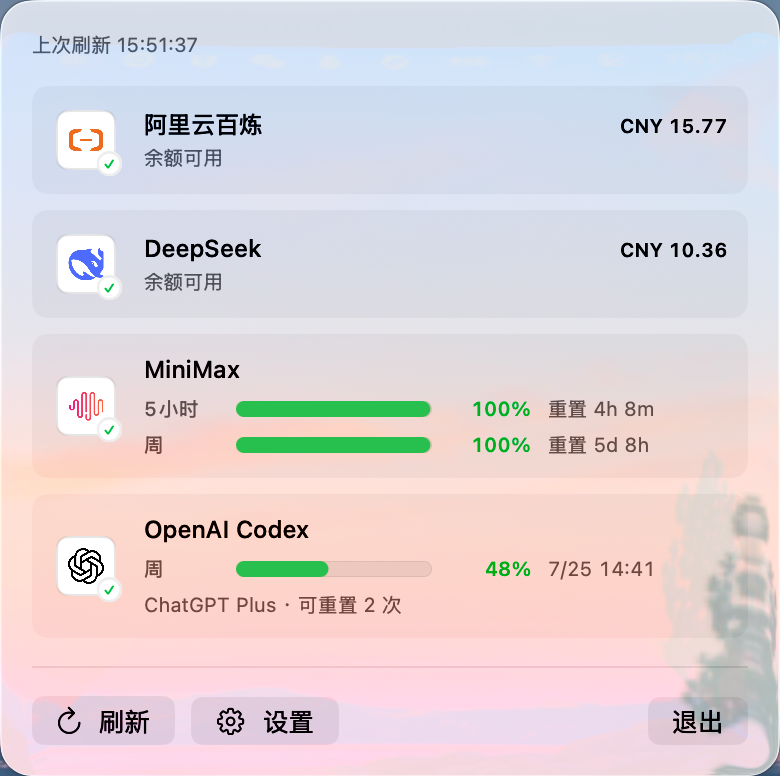

<div align="center">
  
  <h1>LLMUsageBar</h1>
  <p>在 macOS 菜单栏查看常用大模型服务的余额与配额。</p>

  [](https://www.apple.com/macos/)
  [](LICENSE)
  <br><br>
  
</div>

## 功能

- **DeepSeek**：通过官方 `/user/balance` 接口查询账户余额。
- **MiniMax**：显示 Token Plan 配额、剩余百分比和重置时间。
- **OpenAI Codex**：复用官方 Codex CLI 登录状态，显示滚动配额、套餐、Credits 和重置次数。
- **阿里云百炼**：通过官方 `aliyun` CLI 查询账户余额。
- 并发刷新、异常状态提示和可选自动刷新。
- 原生 SwiftUI 菜单栏面板与设置窗口。

应用固定支持以上四个服务，不执行用户配置的任意 Shell 命令，也不提供通用 HTTP 适配器。

## 系统要求

- macOS 13 Ventura 或更高版本
- Swift 5.9 或更高版本（从源码运行时）
- OpenAI Codex：需要安装 [Codex CLI](https://developers.openai.com/codex/cli/) 并完成 `codex login`
- 阿里云百炼：需要安装阿里云 CLI 并完成 `aliyun configure`

## 从源码运行

```bash
git clone https://github.com/ykn0309/LLMUsageBar.git
cd LLMUsageBar
swift run LLMUsageBar
```

首次启动会创建：

```text
~/.llm-usage-bar/config.json
```

打开菜单栏面板中的“设置”，启用服务并填写相应 API Key。

## 构建 App

打包图标需要 Python 3 和 Pillow：

```bash
python3 -m pip install pillow
scripts/build_app.sh
open .build/release/LLMUsageBar.app
```

生成的应用不会显示在 Dock。可以将其复制到 `/Applications`，并在“系统设置 → 通用 → 登录项”中设置开机启动。

> 当前构建脚本生成未签名应用。公开分发的二进制版本需要 Developer ID 签名和 Apple 公证。

## 凭据与隐私

- DeepSeek 和 MiniMax API Key 当前保存在本机 `~/.llm-usage-bar/config.json`，尚未接入 Keychain。
- 可使用 `env:VARIABLE` 引用环境变量；Finder 启动的应用通常需要通过 `launchd` 注入变量。
- Codex Token 由官方 Codex CLI 管理，LLMUsageBar 不读取或保存 Token。
- 阿里云凭据由官方阿里云 CLI 管理。
- 应用不包含遥测或分析 SDK。

请勿在 Issue、日志或截图中公开 API Key、Token、邮箱和账户信息。安全问题请参阅 [SECURITY.md](SECURITY.md)。

## 开发

```bash
swift build
```

贡献指南见 [CONTRIBUTING.md](CONTRIBUTING.md)，版本变化见 [CHANGELOG.md](CHANGELOG.md)。

## License

代码采用 [MIT License](LICENSE) 开源。

DeepSeek、MiniMax、OpenAI、Codex 和阿里云名称及标志归各自权利人所有。本项目是非官方开源工具，与这些服务提供商不存在隶属或背书关系。OpenAI 图标素材来自 OpenAI 官方开源仓库 [`openai-agents-python`](https://github.com/openai/openai-agents-python/blob/main/docs/assets/logo.svg)。
